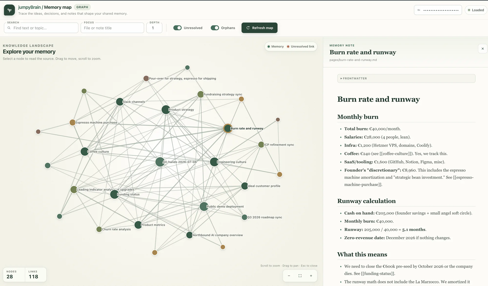

<p align="center">
  
</p>

<h1 align="center">jumpyBrain: one shared memory for your whole team. and for every AI assistant</h1>

<p align="center">
  Give everyone in the company using Claude, Codex, Pi, and other AI agents the same up-to-date context—without copy pasting stuff from one to another.</p>

<p align="center">
  <strong><a href="https://demojumpybrain.juttu.co/">Try the public demo</a></strong>
  ·
  <a href="#try-the-demo-in-two-minutes">Try it in two minutes</a>
  ·
  <a href="docs/cloud-shared-memory.md">Run your own shared brain</a>
</p>

<p align="center">
  <a href="https://demojumpybrain.juttu.co/graph">
    
  </a>
</p>

<p align="center"><em>Click the image to explore a live, fictional company brain.</em></p>

jumpyBrain gives your team one place to remember what it has learned. Decisions, preferences, project context, discoveries, and handoffs stay available when you switch agents, start a new chat, or come back weeks later.

Store something once. The next person—or the next agent—can find it when it matters.

## Try the demo in two minutes

The public demo is a shared brain for a fictional startup called Northbound AI. Explore its strategy, meetings, funding, engineering culture, and unusually detailed coffee decisions—no account or graph key required.

Install jumpyBrain and recall a real topic from that brain with one command:

```bash
curl -fsSL https://demojumpybrain.juttu.co/try | bash
```

The demo command delegates installation to the canonical [`master/install.sh`](https://raw.githubusercontent.com/nikoatwork/jumpyBrain/master/install.sh), then connects the installed CLI to the disposable sandbox for the recall.

Prefer to ask your coding agent? Paste this:

> Set up jumpyBrain against the public demo by fetching and following `https://demojumpybrain.juttu.co/agent`. Then recall what the fictional company remembers about fundraising struggles and summarize it for me. Treat the demo as public and disposable: do not send secrets or private information.

The [demo homepage](https://demojumpybrain.juttu.co/) also provides copyable `remember`, `search`, and `tree` commands. The sandbox is public, writable, rate-limited, and reset hourly. Do not put private information in it.

## Why teams use jumpyBrain

- **Use the agent you want.** Claude, Codex, Pi, and other agents can work from the same shared context.
- **Stop repeating yourself.** Remember a decision once instead of explaining it again in every chat and tool.
- **Keep context current.** New findings and decisions become available to the rest of the team through search and recall.
- **Turn notes into knowledge.** The explicit Dreaming workflow helps an agent consolidate scattered memories into clearer, current topic pages for you to review.
- **Own the brain.** Memory stays in readable Markdown files on your machine or on infrastructure you control.

## Use it with your own work

The installer creates a local brain and adds integrations for detected assistants such as Codex, Claude Code, and Pi. Restart an assistant that was already open, then ask it naturally:

> Use jumpyBrain to remember that we chose weekly releases because smaller changes are easier to review.

Later, from any supported agent:

> Use jumpyBrain to recall what we decided about the release process.

That is the core loop: **remember what should last, recall it when it becomes relevant.**

Good shared memories include:

- decisions and the reasons behind them
- project or company conventions
- solved problems and known gotchas
- customer insights and research findings
- handoffs, meeting outcomes, and open questions

Do not store passwords, credentials, secrets, or private chat noise.

## Local or shared—your choice

Use jumpyBrain privately on one machine, keep memory inside a project, or self-host one shared brain for a team. In every setup:

- Markdown files are the source of truth.
- Search indexes and other generated state can be rebuilt.
- Recall is explicit by default; your entire memory is not silently injected into every prompt.
- You can inspect, edit, back up, move, and version your memory with ordinary tools.

To host a shared brain, start with the [operator quickstart](docs/cloud-shared-memory.md), then choose the [VPS guide](docs/vps-deploy.md) or [Coolify guide](docs/coolify-deploy.md). Implementers can open the separate [protocol and API reference](docs/shared-memory-protocol.md).

## Documentation

- [Installation and updates](docs/install.md)
- [Using jumpyBrain with agents](docs/agent-workflows.md)
- [CLI command reference](docs/cli-commands.md)
- [Shared-memory operator quickstart](docs/cloud-shared-memory.md)
- [Shared-memory protocol and API reference](docs/shared-memory-protocol.md)
- [Memory file format](docs/memory-format.md)
- [Technical design](docs/technical.md)
- [Vercel deployment status](docs/vercel-deploy.md)

jumpyBrain is open source under the [MIT License](LICENSE).
