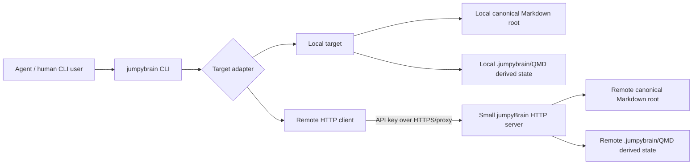
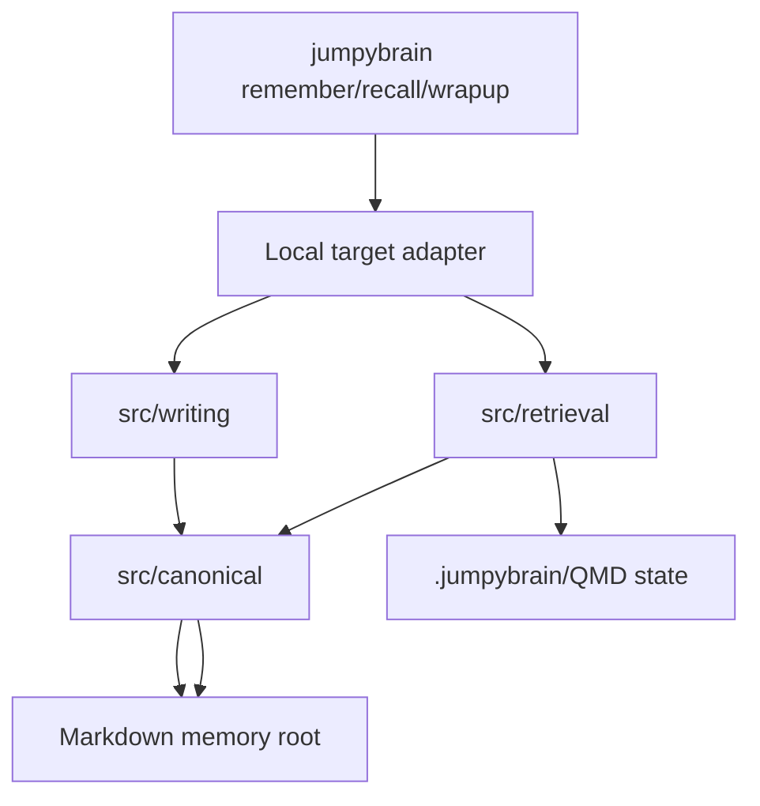
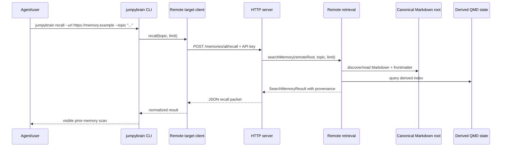

# jumpyBrain targets architecture sketch

Status: reviewed during the CLI/runtime split planning. This remains a design sketch, not an implementation directory contract. It is useful as the start of the remote-target/client spec, but target configuration is deferred until after the CLI boundary and runtime adapter boundaries are clear.

This colocated design note is the working sketch for `local` and `remote` memory targets. It should be reviewed again before implementation code lands here.

## Intent

Keep the CLI experience stable while allowing the same commands to operate against either:

- a local Markdown memory root on disk, or
- one shared remote Markdown memory served by a small authenticated HTTP server.

Markdown remains canonical in both modes. Indexes and QMD state remain derived and rebuildable.

## High-level shape



The target adapter is a CLI composition seam, not a new canonical data model. Local operations should continue to call the existing public API. Remote operations call HTTP endpoints that return equivalent result shapes.

## Local target flow



Local mode should remain boring: no server process, no HTTP dependency, no API key requirement, no remote config requirement.

## Remote recall sequence



## Remote append-only write sequence

```mermaid
sequenceDiagram
  participant A as Agent/user
  participant C as jumpybrain CLI
  participant T as Remote target client
  participant S as HTTP server
  participant WQ as Server write queue/mutex
  participant W as Writer/validator
  participant M as Canonical Markdown root
  participant Q as Derived QMD state

  A->>C: cat wrapup.md | jumpybrain wrapup --url https://memory.example --title "..."
  C->>T: wrapup(title, body, tags, optional topic)
  T->>S: POST /memories/all/wrapups + API key + Idempotency-Key
  S->>WQ: enqueue create_file operation
  WQ->>W: validate/build Markdown + frontmatter id
  W->>M: atomic create sessions/<timestamp>-<id>.md
  WQ->>Q: mark index stale/dirty support state
  S-->>T: file created; index may be stale
  T-->>C: MemoryWriteResult-compatible response
  C-->>A: wrote remote session wrapup
```

## Proposed module boundaries

```text
CLI boundary
  -> local transport/runtime adapter    # local commands against a filesystem memory root
  -> remote transport/client adapter    # future commands against a hosted server URL

runtime app
  -> core/domain modules                # Markdown memory semantics, setup, writing, processing, result shapes
  -> QMD adapter                        # QMD process/cache/index/search ownership

server boundary
  -> runtime app                        # server-local Markdown root and derived QMD state
  -> remote API/auth/request validation # when hosted HTTP exists

core/domain modules                     # no imports from CLI, targets/client, server, or QMD adapter internals
QMD adapter                             # no imports from CLI or server command parsing
server boundary                         # no imports from CLI command parsing
```

The server is an adapter around the same runtime used locally. It must not become the owner of canonical memory semantics, and the CLI must not become the owner of QMD process/cache behavior.

## Complexity audit

### 1. Target configuration can become a second product

Risk: named targets, target inheritance, secrets in committed config, per-repo overrides, user-global config, and default target switching can sprawl quickly.

Lean V1 recommendation:

- keep `--root <path>` as the local path contract;
- add an explicit remote flag/URL path first, e.g. `--remote-url` or `--target-url`;
- read the API key from an env var such as `JUMPYBRAIN_API_KEY`;
- only later add named targets if repeated usage is painful.

Decision: V1 uses URL-only remote selection. Avoid named targets for now. A command should point at a remote with an explicit URL/configured URL, while the API key comes from environment or uncommitted local config. Do not introduce target registries or target names in V1.

### 2. Operation log may be unnecessary for append-only V1

Risk: an operation log introduces another durable store that can drift from canonical Markdown.

Lean V1 recommendation:

- make canonical Markdown file creation the accepted write record;
- use atomic file creation and file-level IDs;
- rely on server request logs for operational debugging;
- add an operation log only if idempotency, auditing, or retry semantics require it.

Decision: include idempotency as an early primitive. Keep it minimal: clients send an idempotency key with create requests, and the server stores a support-state mapping under `.jumpybrain/remote/`, not in canonical Markdown. The idempotency record exists to make retries safe; it is not canonical memory.

For HTTP shape, prefer the normal API pattern: an `Idempotency-Key` request header. Example:

```http
POST /memories/all/wrapups HTTP/1.1
Authorization: Bearer <api-key>
Idempotency-Key: 01JABC...
Content-Type: application/json

{
  "title": "Session wrapup",
  "body": "## Findings\n...",
  "tags": ["cloud-memory"]
}
```

A body field such as `"idempotencyKey": "..."` would also work technically, but it mixes transport/retry metadata with the memory payload. Header-only is cleaner for V1. If a retry sends the same key and same effective request, the server returns the original create result instead of creating another file.

Decision: the CLI generates this header automatically for remote create requests. Users should not have to think about idempotency keys. If the CLI retries the same HTTP request, it must reuse the same generated key for that retry attempt. The server should reject create requests that omit `Idempotency-Key`, because duplicate-safe writes are part of the remote API contract.

### 3. Write-to-index timing can surprise users

Risk: if a remote write succeeds but recall does not see it immediately, teammates may think memory is broken. If every write reindexes synchronously, the write path may become slow and fragile.

Lean V1 options:

- explicit indexing: writes are fast; operators run maintenance indexing before recall;
- asynchronous/debounced reindex: write succeeds, server marks index dirty, a background process catches up;
- cron-driven reindex: simplest ops model for a VPS; cron calls the index endpoint periodically.

Decision: remote writes must not block on indexing. The write API returns success once the canonical Markdown file is created and idempotency state is recorded. Reindexing is exposed as an authenticated API endpoint, `POST /memories/all/index`, so it can be called manually by the CLI or periodically by cron. This mirrors the rest of remote jumpyBrain: the API is the control plane, and clients/ops automation hit the API rather than touching server files directly. In-process async/debounced indexing is deferred unless cron/manual indexing proves insufficient. Recall/status responses should be able to report that the index may be stale.

### 4. Server deployment must not break local-first usage

Risk: package install or CLI commands start requiring server dependencies, listening ports, API keys, or HTTPS assumptions.

Lean V1 recommendation:

- server entrypoint is opt-in;
- local CLI remains unchanged and testable without server config;
- server speaks plain HTTP locally and expects HTTPS at the reverse proxy;
- no daemon/background process for local mode.

### 5. Remote API can accidentally create a new schema

Risk: HTTP request/response types diverge from existing retrieval result, memory write, and index result shapes.

Lean V1 recommendation:

- remote responses should wrap or mirror existing public API result shapes;
- add only transport metadata where necessary, e.g. `target: "remote"`, `serverVersion`, or `indexStatus`;
- do not invent remote-only provenance concepts.

### 6. Authentication can imply user/permission modeling

Risk: API keys grow into accounts, teams, RBAC, scopes, invitations, dashboards, and audit UI.

Lean V1 recommendation:

- static API keys from env/config;
- optional key label/author name for frontmatter, e.g. `JUMPYBRAIN_API_KEYS="label:hash,label2:hash"` later;
- one permission level: read/write/index for the shared memory;
- rotate keys by editing server config and restarting.

Decision: do not record authors in V1. Remote-created files can record `source: "jumpybrain-remote"` and file-level IDs/timestamps, but no API-key label or human identity is required yet.

### 7. Remote Markdown root layout should stay boring

Risk: server support files, operation logs, queue state, and auth metadata pollute canonical memory directories or get indexed.

Lean V1 recommendation:

```text
remote-memory/
  jumpybrain.json
  notes/
  sessions/
  findings/
  decisions/
  preferences/
  .jumpybrain/
    # derived QMD/index state and any server support state
```

Anything not intended for recall belongs under `.jumpybrain/` or outside the memory root.

### 8. Concurrency does not need collaborative editing yet

Risk: trying to solve Notion/Git-style editing introduces block IDs, patch ranges, conflict queues, and Markdown marker stripping.

Lean V1 recommendation:

- only append/create files through the remote API;
- use unique file IDs and atomic `wx` file creation;
- serialize write-side support-state updates with a tiny in-process mutex;
- defer update/delete/edit conflicts until actual editing pressure exists.

### 9. Scaling assumptions should be explicit

Risk: one Node process with local disk works for a VPS, but later multi-process/container deployments can break in-process mutexes and local QMD state assumptions.

Lean V1 recommendation:

- document V1 as single-server-process over one local disk memory root;
- avoid claiming horizontal scale;
- make backups filesystem-level;
- if multi-process becomes necessary, revisit file locking or a real queue.

## Decisions already accepted

- Remote V1 uses the same canonical Markdown files as local mode.
- There is one shared remote memory namespace.
- Remote writes are append-only file creates with file-level IDs.
- No block IDs, hidden Markdown comments, patch queues, CRDTs, or collaborative editing in V1.
- The server owns remote indexing/recall; the CLI does not maintain a normal remote mirror.
- API-key auth is enough for the first self-hosted version.
- Remote target selection is URL-only in V1; avoid named targets/registries.
- Remote writes do not synchronously trigger indexing in V1; authenticated `POST /memories/all/index` is the reindex API and can be called by the CLI or cron.
- Idempotency is included early as minimal support state under `.jumpybrain/remote/`.
- Remote create requests use a CLI-generated `Idempotency-Key` HTTP header; users do not provide it manually, and the server rejects create requests without it.
- Remote-created files do not record authors/API-key labels yet.
- Future-proof HTTP paths use a collection segment such as `/memories/all/recall`, with `all` as the V1 shared memory collection.

## Decisions still open before coding

1. Server command shape: separate binary/command such as `jumpybrain-server`, or `jumpybrain serve`? Owner has no strong preference.
2. Stale-index response shape for `status`, `recall`, and write responses.


## Current recommended lean path

1. Finish the CLI/runtime split so command parsing, runtime composition, and QMD ownership are separate.
2. Add a tiny local transport/runtime adapter first.
3. Keep remote target selection URL-only and environment-secret based.
4. Add a small server with auth, status, recall, remember/wrapup create, and explicit `POST /memories/all/index`.
5. Use atomic append-only Markdown file creation plus minimal idempotency support state.
6. Mark the index dirty after writes; refresh through cron or CLI calls to the reindex API.
7. Expose HTTP endpoints under `/memories/all/...` for the single V1 shared memory.
8. Keep all support state under `.jumpybrain/` and keep canonical Markdown clean.
